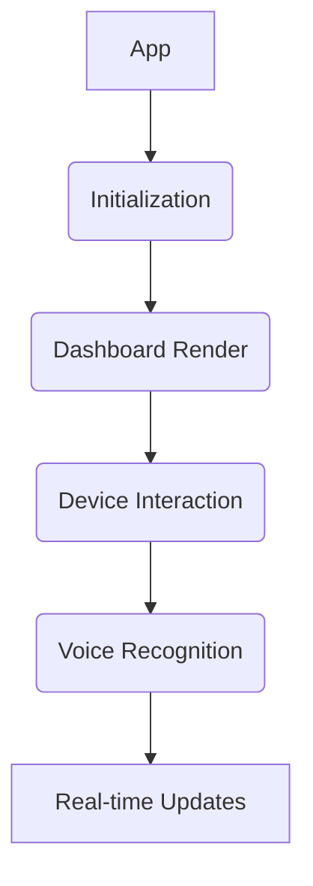

# App Specifications

The `apk` folder contains the compiled Android application package (APK) file for the PicoNest mobile app. This section provides comprehensive specifications, including code flow, block diagram, Android specifications, and a guide on how to use the app effectively.

### Code Flow

The PicoNest mobile app is designed with a modular and user-friendly code flow, ensuring efficient communication with the home automation system. The primary code flow follows these steps:

1. **Initialization:**
   - The app initializes necessary components, sets up required connections, and prepares for user interaction.

2. **Dashboard Rendering:**
   - Upon successful authentication, the app renders the dashboard, displaying an overview of connected devices and their current states.

3. **Device Interaction:**
   - Users can interact with individual devices (e.g., lights, thermostat) through an intuitive control interface within the app.

4. **Voice Recognition Integration:**
   - The app seamlessly integrates voice recognition technology, allowing users to control devices using natural language commands.

5. **Real-time Updates Handling:**
   - The app continuously receives real-time updates from the home automation system, ensuring that the dashboard reflects the latest device states.

#### Block Diagram

The block diagram below provides a high-level overview of the key components and interactions within the PicoNest mobile app:

### Android Specifications

#### Minimum Requirements

- **Android Version:** Android 6.0 (Marshmallow) and above.
- **Permissions:** The app requires permissions for network communication, access to device features, and voice recognition.

#### Supported Devices

The PicoNest mobile app is optimized for a wide range of Android devices, including smartphones and tablets. It is recommended to use devices with medium to high screen resolutions for an optimal user experience.

### How to Use the App Effectively

1. **Download and Install:**
   - Download the APK file from the [APK folder](../app/apk/).
   - Install the app on your Android device following the standard installation procedure.

2. **Pair with HC05:**
   - Familiarize yourself with the dashboard, displaying an overview of connected devices and their status.
   - Familiarize yourself with the dashboard, displaying an overview of connected devices and their status.

2. **Explore the Dashboard:**
   - Familiarize yourself with the dashboard, displaying an overview of connected devices and their status.

3. **Enable Bluetooth Connection:**
   - Familiarize yourself with the dashboard, displaying an overview of connected devices and their status.
   - Familiarize yourself with the dashboard, displaying an overview of connected devices and their status.

4. **Explore the Dashboard:**
   - Familiarize yourself with the dashboard, displaying an overview of connected devices and their status.

5. **Device Control:**
   - Navigate to the device control section to interact with individual devices.
   - Use the intuitive controls to manage lights, thermostat, and other connected devices.

6. **Voice Commands:**
   - Utilize the voice recognition feature by tapping the microphone icon.
   - Speak natural language commands to control devices with ease.

### Note

- The block diagram simplifies the architecture for clarity. Refer to the actual source code for a detailed understanding of the app's implementation.

- Ensure that your Android device meets the minimum requirements for optimal app performance.

- For developers interested in contributing or understanding the app's codebase, explore the source code in the [`app`](../app/) folder.

For any questions related to the PicoNest mobile app specifications or usage, feel free to reach out to the project maintainers.

